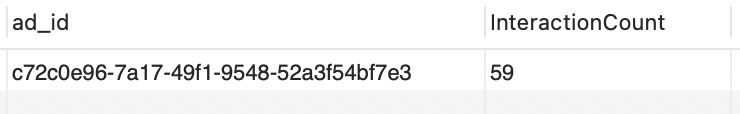

**Problem Statement:**
An advertising agency is running a digital advertising campaign for a client. The campaign involves displaying ads on various online platforms. To evaluate the campaign's effectiveness and make data-driven decisions, the agency needs to analyze a dataset containing information about the campaign's performance, ad placements, and user interactions.

**Dataset Details:**

The dataset required for this project should include the following tables:

1. **Campaign Data:**
   - `campaign_id` (unique identifier for each campaign)
   - `campaign_name` (name of the advertising campaign)
   - `start_date` (start date of the campaign)
   - `end_date` (end date of the campaign)
   - `budget` (total budget allocated for the campaign)

2. **Ad Placement Data:**
   - `ad_id` (unique identifier for each ad placement)
   - `campaign_id` (foreign key linking to the campaign it belongs to)
   - `platform` (the online platform where the ad was displayed, e.g., Facebook, Google Ads)
   - `placement_cost` (the cost incurred for placing the ad on the platform)

3. **User Interaction Data:**
   - `interaction_id` (unique identifier for each user interaction with an ad)
   - `ad_id` (foreign key linking to the ad placement)
   - `user_id` (unique identifier for each user)
   - `interaction_type` (e.g., click, view, conversion)
   - `interaction_date` (date and time when the interaction occurred)

**Questions to Answer using SQL:**

1. **Campaign Analysis:**
   - What is the total budget allocated for each campaign?
         
   **SQL Query:**
      
       
   
   **Output:**
      
      

   - How many campaigns are currently active? 1.201/2

   **SQL Query:**

      

   **Output:**

      

   - What is the average budget spent per active campaign? 1.301/2

   **SQL Query:**

      

   **Output:**

      
   
2. **Ad Placement Analysis:**
   - Which platform has the highest total placement cost?
   
   **SQL Query:**

      

   **Output:**

      

   - What is the average placement cost per platform?

   **SQL Query:**

      

   **Output:**

      

   - Which campaign has the highest total placement cost?

   **SQL Query:**

      

   **Output:**

      

3. **User Interaction Analysis:**
   - How many interactions (clicks) occurred for each ad placement? 3.101/2

   **SQL Query:**

      

   **Output:**

      

   - What is the average budget spend per click for each campaign? 3.201/2

   **SQL Query:**

      

   **Output:**

      

4. **Campaign Performance Analysis:**
   - What is the total spend for each campaign? 4.101/2

   **SQL Query:**

      

   **Output:**

      

   - How does the actual spend compare to the budget for each campaign? 4.201/1

   **SQL Query:**

      

   **Output:**

      

5. **Time-based Analysis:**
   - How do user interactions vary by day and time of day?  5.101/2

   **SQL Query:**

      

   **Output:**

      

   - How do user interactions vary by time of day? 5.201/2

   **SQL Query:**

      

   **Output:**

   

   - Is there a specific day of the week or time period that sees the highest user engagement? 5.301/2

   **SQL Query:**

      

   **Output:**

      

   
6. **Ad Engagement Analysis:**
   - What is the average number of interactions (clicks and views) per ad placement? 6.101/2

   **SQL Query:**

   **Output:**

      

   - Which ad placement had the highest total interactions? 6.201/2

   **SQL Query:**

      

   **Output:**

      

7. **Campaign Duration Analysis:**
   - How long did each campaign run in terms of days?

   **SQL Query:**

      

   **Output:**

      

   - Analyse duration by interaction_type for each campaign.

   **SQL Query:**

      

   **Output:**

      

8. **Budget Allocation Analysis:**
   - How much of the budget is remaining for each active campaign?

   **SQL Query:**

      

   **Output:**

      

   

By answering these questions using SQL queries on the provided dataset, the advertising agency can gain valuable insights into the performance of the campaign, optimize budget allocation, and make data-driven decisions to improve ROI.

Creating a Business Intelligence (BI) dashboard with the dataset and SQL problems provided can offer valuable insights into your advertising campaign's performance. Here are some key performance indicators (KPIs) and charts you can create for your BI dashboard:

**Key Performance Indicators (KPIs):**

1. **Total Ad Campaigns:** Display the total number of ad campaigns currently in the dataset. This KPI gives an overview of the campaign volume.

2. **Total Ads Running:** Show the total number of ads currently active or running across all campaigns. This KPI provides insights into the scale of ad placements.

3. **User Interactions:** Present the total number of user interactions (clicks, views, and conversions) recorded across all campaigns. This KPI helps assess user engagement.

4. **Overall % of Budget Spent:** Calculate the percentage of the total budget spent compared to the allocated budget across all campaigns. This KPI offers insights into budget utilization.

5. **Average Campaign Duration:** Represent the average duration, in days, for all active advertising campaigns. It provides insights into the typical length of campaigns.

**Charts:**

1. **Time Series Chart for Total User Interactions:** Plot the total number of user interactions (clicks, views, and conversions) over time (e.g., daily, weekly, or monthly).

2. **Budget Allocation by Campaign Pie Chart:** Show a pie chart illustrating the allocation of the total budget across different campaigns.

3. **Placement Cost by Campaign Bar Chart:** Compare CTR for each campaign using a bar chart.

4. **Conversion Rate by campaign Bar Chart:** Compare the conversion rate for each campaign using bar chart.

5. **Interaction Type by Campaign Bar Chart:** Compare interaction type count for each campaign using a stacked bar chart.

These KPIs and charts will provide a comprehensive view of your advertising campaign's performance, helping you track progress, identify trends, and make data-driven decisions. I have choosen the most relavent ones based on my business problem statement.

