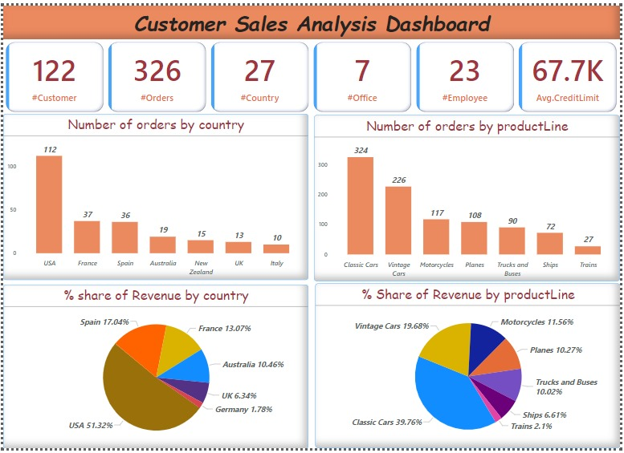
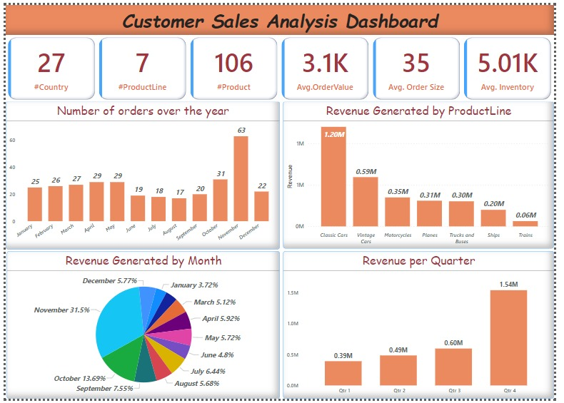

# SQL_projects : Customer Analysis Dashboard

DataSource: https://www.mysqltutorial.org/mysql-sample-database.aspx

## Problem Statement
The current problem revolves around the need for comprehensive data analysis and visualization for tracking various key performance indicators (KPIs) and metrics related to customer orders, product lines, revenue, and inventory in the organization. The aim is to gain insights into the company's performance, identify trends, and make data-driven decisions to optimize operations and drive business growth.

## Technology Used
The dashboard has been built using Power BI, a powerful business analytics tool that allows for the creation of interactive data visualizations and business intelligence capabilities.

## Key Performance Indicators (KPIs) Included
1. Number of Customers - Total count of unique customers.
2. Number of Orders Received - Total count of orders received over a specific period.
3. Number of Countries - Total count of distinct countries the company operates in.
4. Number of Offices - Total count of company offices.
5. Number of Employees - Total count of company employees.
6. Average Credit Limit of Customers - Mean credit limit across all customers.
7. Number of Product Lines - Total count of product lines offered.
8. Number of Products - Total count of distinct products in the inventory.
9. Average Order Value - Mean value of orders placed.
10. Average Order Size - Mean size of orders in terms of quantity or price.
11. Inventory Size - Total count of products in the inventory.

## Charts Included
1. Number of Orders by Country - Visual representation of orders categorized by country.
2. Number of Orders by Product Line - Visual representation of orders categorized by product line.
3. Percentage Share of Revenue by Country - Pie chart illustrating the revenue percentage from different countries.
4. Percentage Share of Revenue by Product Line - Pie chart illustrating the revenue percentage from different product lines.
5. Number of Orders Over the Years - Line chart showing the trend of the number of orders over the years.
6. Revenue Generated by Month - Bar chart showing revenue generated each month.
7. Revenue Generated by Product Line - Bar chart showing revenue generated by each product line.
8. Revenue by Quarter - Bar chart showing revenue generated in each quarter.

## Observations on Power BI Dashboard

Here are the key observations made from the analysis of the Power BI dashboard:

1. **Dominance of the USA:** The United States accounts for approximately half of the total orders and contributes to over 50% of the overall revenue, indicating its significant role in the company's sales.

2. **Significance of Classic Cars:** Classic cars play a vital role in the company's revenue, contributing to around 40% of the total revenue, with 20% of this revenue coming solely from the USA.

3. **Key Revenue-Generating Countries:** The majority, around 80%, of the total revenue is driven by just three countries: the USA, Spain, and France, emphasizing the importance of these markets for the company's profitability.

4. **Contribution of Specific Products:** Two product categories, classic cars (40%) and vintage cars (20%), collectively account for 60% of the total revenue, highlighting their crucial role in the company's sales.

5. **Best Performing Quarter and Month:** The fourth quarter emerges as the best performing quarter, generating 49% of the total revenue, with November alone contributing to 30% of the overall revenue, indicating a strong end-of-year performance.

6. **Underperforming Product Categories:** Trains and ships are the least performing product categories, contributing to only 2% of the total revenue. Among them, the USA, Spain, and Australia are the primary contributors, signaling potential areas for improvement or strategic adjustments.

7. **New Zealand's Low Revenue Impact:** Despite being among the top-performing countries, New Zealand generates relatively low-value orders, not contributing significantly to the company's overall revenue, suggesting a need for focused strategies to enhance its revenue contribution.

These observations provide valuable insights into the key drivers and challenges within the business, offering actionable points for strategic decision-making and operational improvements.

## Way Forward
The current iteration of the Power BI dashboard lays the foundation for comprehensive data analysis. Moving forward, there is a possibility to integrate more advanced analytics, predictive modeling, and real-time data streaming for more proactive decision-making. Additionally, the inclusion of more granular and specific KPIs can provide deeper insights into various aspects of the business operations.

## At The End
Power BI dashboard serves as a robust tool for visualizing and understanding key business metrics, enabling stakeholders to make informed decisions. By regularly monitoring the dashboard, the company can identify areas for improvement, optimize resource allocation, and develop strategies to achieve its business goals and objectives. The intuitive visualizations and interactive features help in better comprehension and interpretation of complex data, leading to more efficient and effective decision-making processes.